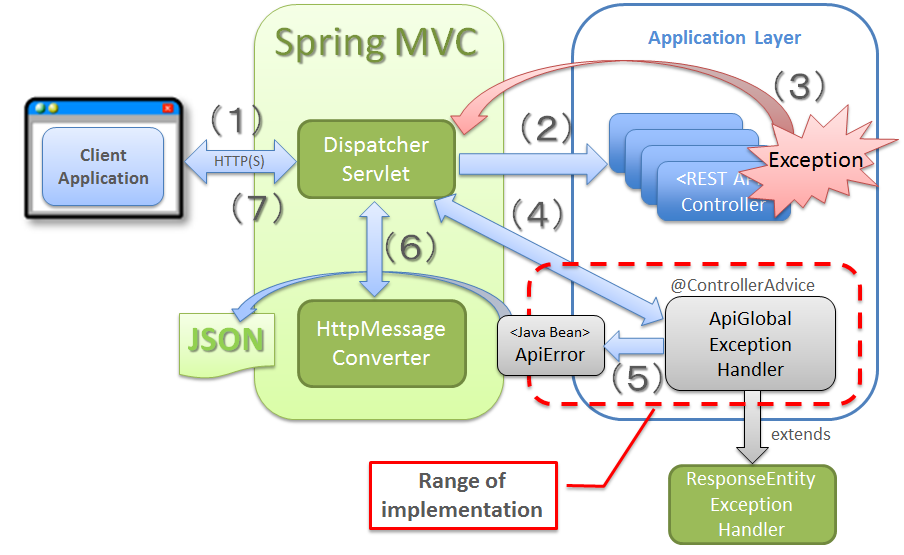

= RESTful Notes API Guide For pricechangewriterservice
Pricing Team
:doctype: book
:icons: font
:source-highlighter: highlightjs
:toc: left
:toclevels: 4
:sectlinks:
:operation-curl-request-title: Example request
:operation-http-response-title: Example response
:snippets: ../../../target/snippets

[[overview]]
= Overview

The Price Change Instructions Write Service exposes a POST endpoint and  writes to Cassandra Table

Right now, Kafka consumer service comsumes this service.

https://code.devops.fds.com/commonservices/pricing/pricechangewriterservice.git (pls see ReadMe file - dev branch)

[[overview-http-verbs]]
== HTTP verbs

RESTful notes tries to adhere as closely as possible to standard HTTP and REST conventions in its
use of HTTP verbs.

|===
| Verb | Usage

| `GET`
| Used to retrieve a resource

| `POST`
| Used to create a new resource

| `PATCH`
| Used to update an existing resource, including partial updates

| `DELETE`
| Used to delete an existing resource
|===

[[overview-http-status-codes]]
== HTTP status codes

RESTful notes tries to adhere as closely as possible to standard HTTP and REST conventions in its
use of HTTP status codes.

|===
| Status code | Usage

| `200 OK`
| The request completed successfully

| `201 Created`
| A new resource has been created successfully. The resource's URI is available from the response's
`Location` header

| `204 No Content`
| An update to an existing resource has been applied successfully

| `400 Bad Request`
| The request was malformed. The response body will include an error providing further information

| `404 Not Found`
| The requested resource did not exist
|===

== Pricing Service Discovery (GCP - internal-load-balancing)

All the pricing microservices are using internal load balancer, and will use all the instances of each microservices. They are capable to use
all features of Google Kubernetes Engine.

https://cloud.google.com/kubernetes-engine/docs/how-to/internal-load-balancing

Internal load balancer
In a mixed environment it is sometimes necessary to route traffic from services inside the same VPC.

In a split-horizon DNS environment you would need two services to be able to route both external and internal traffic to your endpoints.

This can be achieved by adding the following annotations to the service based on cloud provider.

metadata:
    name: price-service
    annotations:
        cloud.google.com/load-balancer-type: "Internal"

== Pricing Services Exception Handling

Across all Pricing microservices, some things to note are as follows:

@ControllerAdvice: Class with Controller Advice annotation, by default, is applicable to all controllers.

@ExceptionHandler (value= Exception/Custom Exception.class): Any method with this annotation will be called when an exception of the type or the sub-type of class specified (Exception.class) is thrown in controller. So, method with @Exceptionhandler annotation is called whenever an exception is thrown and the exception from the controller class matches the configured Exception classes.

[[overview-errors]]
== Errors

Whenever an error response (status code >= 400 or status code >= 500) is returned, the body will contain a JSON object
that describes the problem. The developers can customize the error/exception messages. For example, few error object has the
following structure:

Whenever an error response (status code >= 400) is returned, the body will contain a JSON object
that describes the problem. The error object has the following structure:

Failed Get Price by Id Request

GET http://localhost:8101/price/2 <- plugin correct api

RESPONSE

{
  "status": "404”,
  "message": "price not found for  id [2]”,
  "timestamp": 1518188855084
}

———————————————————————————————————————————————————

Failed GET price by division

GET http://localhost:8101/price/nn

RESPONSE

{
    "status": "404",
    "message": "No price found for the division [nn]",
    "timestamp": 1518189938450
}

== Logging Framework
Pricing Services Logging / Monitoring framework is divided into two streams:

(1) Application Logging going through GCP log aggregator and to GCP StackDriver

(2) Prometheus and Grafana are used to collect specific metrics that need to be monitored such as used memory and storage as well as general ones reporting on the status of the service.
Conveniently, Prometheus exposes a wide variety of metrics that can be easily monitored. By adding Grafana as a visualization layer, we can easily set up a monitoring stack for our monitoring stack.

We are finalizing this. Please stay tuned for a next version of this doc.

[[resources-issues-list]]
=  Resources

The Issue resource is used to list all issues and a particular issue given an ID

[[resources-items-list]]
== Price Rest Endpoints

A `POST` request will create a new price change json instruction

.Create price change instruction with `http`

include::{snippets}/price-post/curl-request.adoc[]

include::{snippets}/price-post/http-request.adoc[]

.the response from the `/pricechangewriter/perm-instructions` endpoint
include::{snippets}/price-post/http-response.adoc[]

.Create price with `httpie`
include::{snippets}/price-post/httpie-request.adoc[]

.the request body from the `/pricechangewriter/perm-instructions` endpoint
include::{snippets}/price-post/request-body.adoc[]

.the response body from the `/pricechangewriter/perm-instructions` endpoint
include::{snippets}/price-post/response-body.adoc[]

